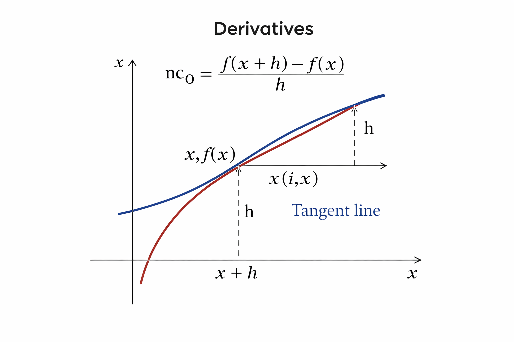

# Derivatives

## Definition
The derivative of a function $f(x)$ at $x$ is

$$
f'(x) = \lim_{h \to 0}\frac{f(x+h)-f(x)}{h}.
$$

## Example
If $f(x)=x^2$, then

$$
f'(x)=2x.
$$

## Visual

## Notes
- Derivative describes instantaneous rate of change.
- Tangent line slope at a point.

