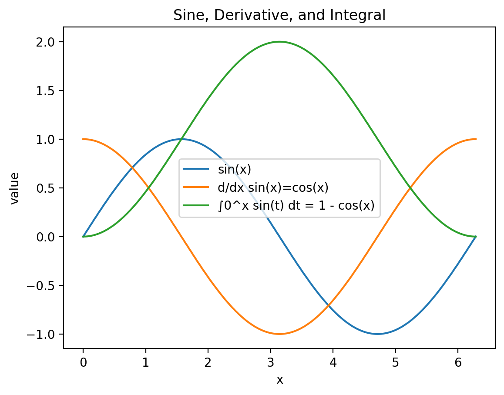

# Limits

## Idea
A limit describes the value that a function approaches as the input approaches a given point.

## Visual intuition

## Notes
- Limits describe behavior near a point, not necessarily at the point.
- They are fundamental for defining derivatives and integrals.

## Formal observation
Limits allow us to rigorously define concepts that involve approaching behavior rather than exact values.

They make it possible to define derivatives and integrals in a mathematically precise way.
