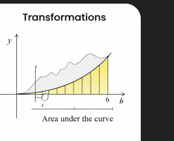

# Transformations

## Idea
A transformation changes the shape, position, or size of a geometric object.

## Visual example

## Notes
- Common transformations: translation, scaling, rotation.
- Area can change or stay invariant depending on the transformation.

## Mathematical perspective
Geometric transformations can be represented using matrices, especially in linear algebra.

This allows transformations to be combined, inverted, and efficiently computed, which is crucial in computer graphics and physics.
